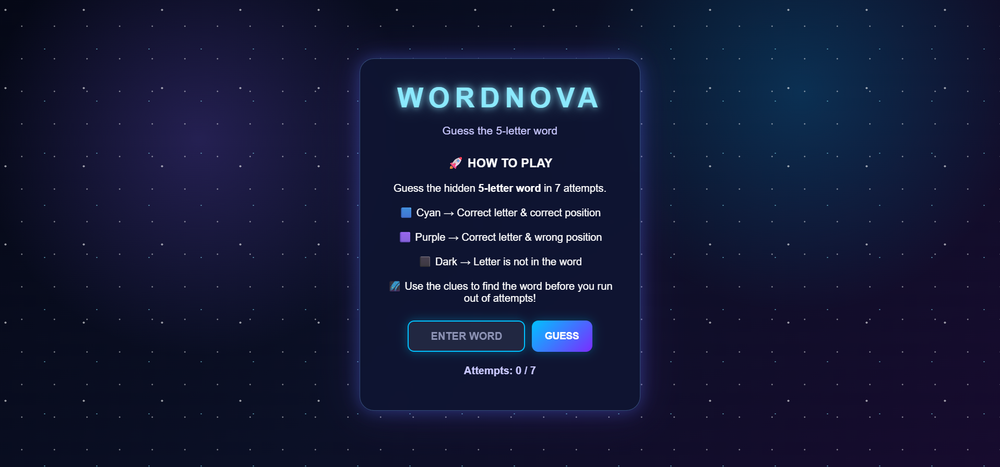
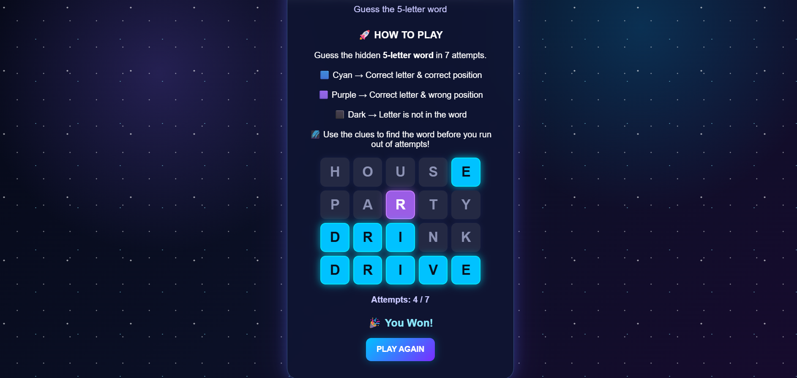

# 🚀 Space Wordle

A space-themed Wordle game built using Python and Flask.

## Features

- Guess the hidden 5-letter word
- Maximum of 6 attempts
- Color-coded feedback for letters
- Random words for each game
- Space-themed UI
- Instructions section for players


## Screenshots

### Home Page

### Game Page


## Technologies Used

- Python
- Flask
- HTML
- CSS
- Jinja2

## How to Run

- Clone the repository
- Create and activate a virtual environment
- Install Flask
- Run the application

```bash
python app.py
```
`Open http://127.0.0.1:5000/ in your browser.`

<!-- screenshots added -->